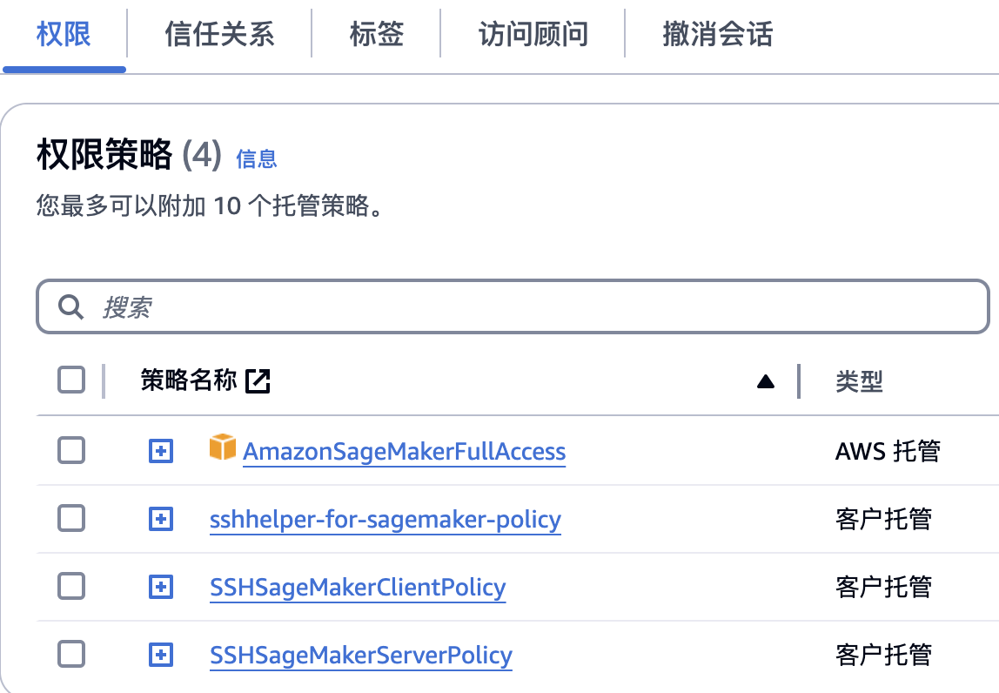
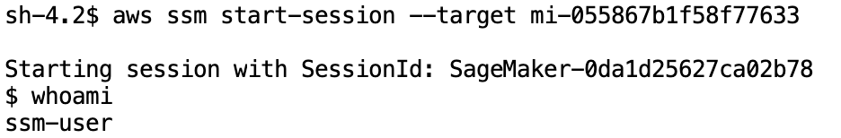
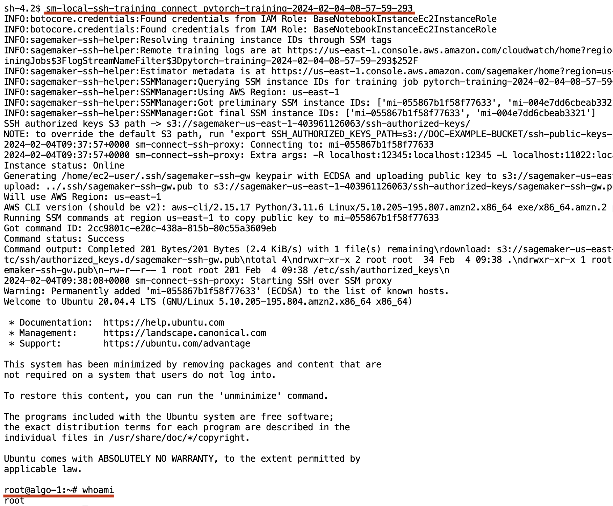
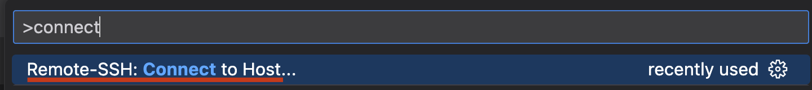
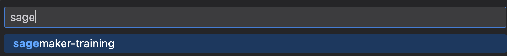
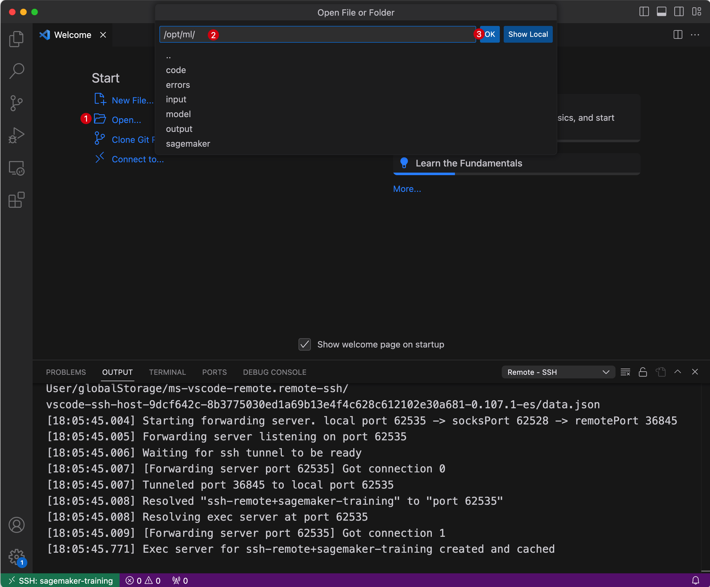
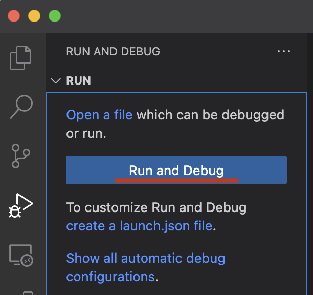
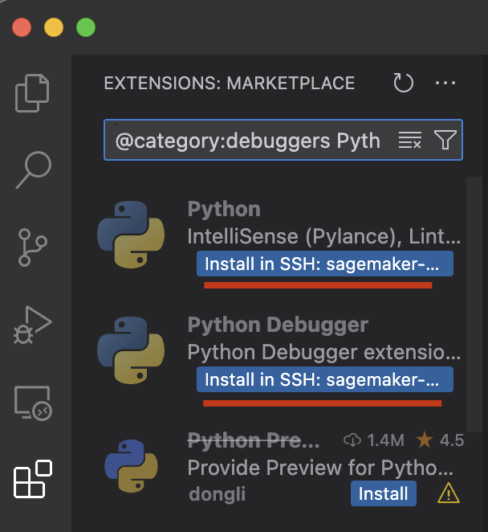
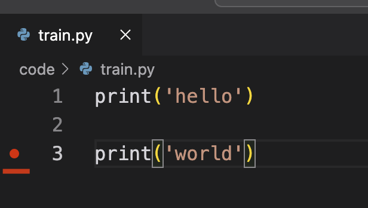
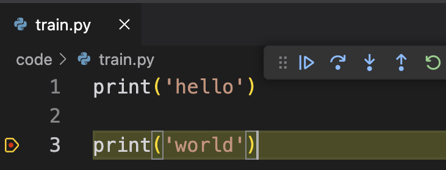

# SageMaker SSH Helper Quick Setup

## 前置资源部署-管理员操作

### 脚本中创建的资源

* IAM Role: sshhelper-for-sagemaker-role, 用于绑定到SageMaker Notebook Instance，以赋予其提交作业的权限。（本地个人电脑环境下，可通过 IAM User AK/SK 方式来获取权限，此时，需要通过后续的add-user脚本赋予用户相关权限）
* IAM Policy: sshhelper-for-sagemaker-policy, 赋予 sshhelper-for-sagemaker-role 访问 S3 桶、SageMaker Full Access。（在脚本完成执行后，可根据实际需要修改 Role/Policy）
* IAM Group: SSHHelperUserGroup, 此用户组下的用户具备提交SM 作业，及SSH访问权限。可通过后续脚本添加普通用户到此组，方便权限管理。
* SSM(System Session Manager) 权限，相关内容如 [文档](https://github.com/aws-samples/sagemaker-ssh-helper/blob/main/IAM_SSM_Setup.md#automated-setup-with-cdk-and-cloud9) 所示。

**注释**: 这里为方便起见，直接将 AmazonSageMakerFullAccess 策略赋予给了 sshhelper-for-sagemaker-role 、SSHHelperUserGroup ，您需要按照自己的权限管理需求进行权限的进一步管控。

### 执行一键部署脚本 - 通过 AWS CloudShell

1. 使用具有管理员权限(AdministratorAccess Policy)的账户登陆 AWS Console
2. 确认 Console 页面右上角 Region 是您使用 SageMaker 的区域，如果不是请切换
3. 打开 左下角 CloudShell，执行 one-click-setup.sh 脚本

```
git clone https://github.com/Chen188/ssh-helper-quickstart

cd ssh-helper-quickstart && bash one-click-setup.sh

# 输出内容类似：
# creating the role sshhelper-for-sagemaker-role ...
# creating the sshhelper-for-sagemaker-policy policy ...
# attaching the sshhelper-for-sagemaker-policy policy
# attaching the AmazonSageMakerFullAccess policy
# ...
```

1. 在提示是否继续的时候，输入 **y**（共两次提示）

### 查看部署结果

在 IAM Console / 角色 页面，可以找到 sshhelper-for-sagemaker-role，在权限 Tab 可以看到如下4个策略： 


### 为普通用户配置权限

如果您当前帐户中还没有 IAM User，请通过控制台创建一个，并启用 AK/SK。然后再执行命令：

```
# 执行此命令，将用户添加到 SSHHelperUserGroup
bash one-click-setup.sh add-user
```

## 配置客户端（执行SSH登录/运行 IDE 的设备）- 普通用户

**安装 ssh-helper**

```
pip install sagemaker-ssh-helper
```

**安装 AWS CLI v2 及 AWS Session Manager CLI plugin.**

```
sm-local-configure
```

**配置 AWS CLI**
请根据 [Set up the AWS CLI](https://docs.aws.amazon.com/cli/latest/userguide/getting-started-quickstart.html) / Long-term credentials，通过如下命令将**普通用户**的权限配置在本地的 AWS CLI 中。

```
aws configure
```

**配置 SSH 客户端**

```
cat <<EOF >> ~/.ssh/config
Host sagemaker-training
  HostName localhost
  IdentityFile ~/.ssh/sagemaker-ssh-gw
  Port 11022
  User root
EOF
```

## 测试 SSH Helper - 普通用户

### 提交训练作业

依次执行 `ssh-helper-quickstart/main.ipynb` 中的代码，提交一个简单的训练作业。（可通过 VSCode 等 IDE 打开此文件）注意，在实验结束时，及时停止此作业，否则，可能产生额外费用。

### 远程连接训练作业容器

请确保使用提交作业时相同的 identify 来执行下面的测试，比如 都使用同一个 IAM User，或者都使用同一个 IAM Role。如果是通过 IAM Role 提交了作业，若想通过 IAM User 访问，则需要先通过 IAM User assume 提交作业时使用的Role，否则会提示权限不足导致访问失败。

#### 方式1: 直接通过SSM

将 target 替换为 main.ipynb 中的实际输出值

```
aws ssm start-session --target mi-055867b1f58f77633
```



#### 方式2: 通过sm-local-ssh-training脚本

将 pytorch-xxx 替换为实际的作业名称。

```
sm-local-ssh-training connect pytorch-training-2024-02-04-08-57-59-293
```



#### 方式3: 通过  VS Code

1. 打通 ssh-tunnel，注意 将 pytorch-xxx 替换为实际的作业名称。

```
sm-local-ssh-training connect pytorch-training-2024-02-04-08-57-59-293
```

1. 启动VS Code，连接远程实例

Command + Shift + P, 输入 connect, 选择 Connect to Host:


选择 sagemaker-training


打开文件路径：


安装debug插件：




安装 Python 及 Python Debugger，然后打开文件，设置断点，并开始debug。




#### 更多使用方式

* AWS 控制台：
    * In AWS Web Console, navigate to Systems Manager > Fleet Manager.
    * Select the node, then Node actions > Start terminal session.
    * Once connected to the container, you would want to switch to the root user with `sudo su -` command.
* 通过  PyCharm，参考文档： [aws-samples/sagemaker-ssh-helper: A helper library to connect into Amazon SageMaker with AWS Systems Manager and SSH (Secure Shell)](https://github.com/aws-samples/sagemaker-ssh-helper/tree/main?tab=readme-ov-file#pycharm-debug-server)
* VNC：[aws-samples/sagemaker-ssh-helper: A helper library to connect into Amazon SageMaker with AWS Systems Manager and SSH (Secure Shell)](https://github.com/aws-samples/sagemaker-ssh-helper/tree/main?tab=readme-ov-file#web-vnc)

